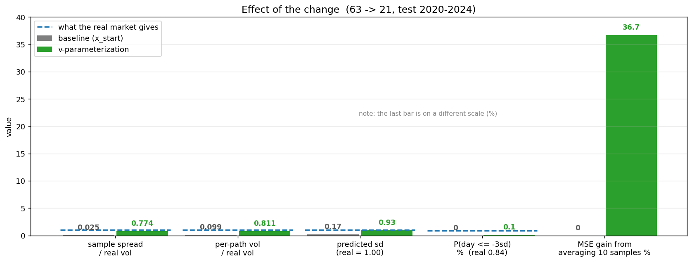
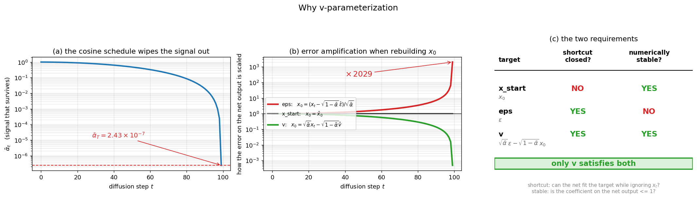

# v-parameterization：修好樣本塌縮

**日期** 2026-08-20 ｜ **基準** `stock_63_21_..._TWO`（x_start）｜ **新模型** `stock_63_21_..._TWO_v`
**測試期** 2020-01-02 ~ 2024-12-31，1216 個 forecast，seq 63 → pred 21

---

## 結果先講

| 指標 | 真實市場 | baseline (x_start) | **v** |
|---|---|---|---|
| **樣本間離散 / 真實波動** | 1.00 | **0.025** | **0.774** |
| 單一路徑波動 / 真實波動 | 1.00 | 0.099 | 0.811 |
| 平均波動比（全測試期） | 1.00 | 0.10 | **0.88** |
| 預測分布 sd | 1.00 | 0.17 | **0.93** |
| P(日報酬 ≤ −3σ) | 0.84% | 0.00% | 0.10% |
| 平均 10 樣本的 MSE 改善 | — | 0.0% | **36.7%** |
| test MSE | — | 1.120 | 2.086 |

**擴散模型終於在生成分布了。** 最後兩列是重點，下面第五節解釋為什麼 MSE 變差反而是好消息。



---

## 一、問題：樣本塌縮

擴散模型應該做的事：不同的噪聲種子產生不同的可能未來，合起來構成一個分布。

baseline 實際在做的事：**不管餵什麼噪聲，都吐出同一條平滑的線。**

實測（32 個窗口 × 10 次抽樣）：

| 量測 | baseline | 判讀 |
|---|---|---|
| 樣本間離散 / 真實波動 | 0.025 | 10 條路徑彼此只差 2.5% |
| 10 條平均後的波動 | 0.095（單條是 0.099） | 幾乎沒下降 |
| 平均 10 條的 MSE 改善 | 0.0% | 等於沒改善 |

第二、三列是決定性證據。若 10 條路徑獨立，取平均後波動應掉到 1/√10 ≈ 0.32 倍、MSE 應明顯改善。實測完全沒動——**10 條線疊起來就是原本那一條**。

### 為什麼會塌縮

網路被要求預測 `x0`（那 21 天的答案本身），而條件很強：63 天真實歷史 + 預訓練的 DLinear 線性預測。

於是出現一條**捷徑**：與其解讀噪聲 `x_t`，不如直接無視它，單純從 `cond` 解碼出「最合理的平均答案」。訓練 loss 照樣會降，因為 MSE 獎勵的正是條件均值。

`x_t` 是唯一的隨機性來源。它被丟掉，擴散過程就形同虛設。

### 這解釋了三個症狀

- **波動只有 0.10** — 條件均值在定義上就是平滑的（漲跌互相抵銷後只剩趨勢）
- **沒有厚尾** — 均值永遠不會是極端值
- **旋鈕力道不足** — 旋鈕唯一能動的是那條唯一的線的斜率

三者同源。

---

## 二、推導

### 前向過程

擴散的加噪過程是

$$x_t = \sqrt{\bar\alpha_t}\,x_0 + \sqrt{1-\bar\alpha_t}\,\epsilon,\qquad \epsilon\sim N(0,I)$$

`ᾱ_t` 從 1 遞減到 0，代表「還剩多少訊號」。網路可以被要求預測三種東西之一，它們互為線性變換，理論上等價——**但數值行為天差地遠**。

### 三種目標與各自的反解

| | 網路預測 | 還原 x0 | 係數 |
|---|---|---|---|
| `x_start` | $x_0$ | $x_0 = \hat x_0$ | 1 |
| `eps` | $\epsilon$ | $x_0 = (x_t - \sqrt{1-\bar\alpha_t}\,\hat\epsilon)\,/\,\sqrt{\bar\alpha_t}$ | $1/\sqrt{\bar\alpha_t}$ |
| **`v`** | $\sqrt{\bar\alpha_t}\,\epsilon - \sqrt{1-\bar\alpha_t}\,x_0$ | $x_0 = \sqrt{\bar\alpha_t}\,x_t - \sqrt{1-\bar\alpha_t}\,\hat v$ | $\sqrt{\bar\alpha_t}$ |

### v 的反解怎麼來的

把前向式與 v 的定義並列：

$$x_t = \sqrt{\bar\alpha}\,x_0 + \sqrt{1-\bar\alpha}\,\epsilon$$
$$v = \sqrt{\bar\alpha}\,\epsilon - \sqrt{1-\bar\alpha}\,x_0$$

第一式乘 $\sqrt{\bar\alpha}$、第二式乘 $\sqrt{1-\bar\alpha}$ 後相減，$\epsilon$ 項消掉：

$$\sqrt{\bar\alpha}\,x_t - \sqrt{1-\bar\alpha}\,v = (\bar\alpha + 1 - \bar\alpha)\,x_0 = x_0$$

得到 $x_0 = \sqrt{\bar\alpha}\,x_t - \sqrt{1-\bar\alpha}\,v$。**兩個係數都 ≤ 1，沒有除法。**

### 兩個必要條件



**條件一：堵住捷徑。** 網路能不能在無視 `x_t` 的情況下擬合目標？

- `x_start` 的目標是 $x_0$，給定 cond 後與 `x_t` 無關 → **可以無視**，捷徑成立
- `eps` 與 `v` 的目標都含 $\epsilon$，而 $\epsilon = (x_t - \sqrt{\bar\alpha}x_0)/\sqrt{1-\bar\alpha}$ 只能從 `x_t` 得知 → **無法無視**

**條件二：數值穩定。** 還原 x0 時網路誤差被放大幾倍？

這個專案用 cosine 排程、100 步，實測 $\bar\alpha_T = 2.43\times10^{-7}$，所以

$$\frac{1}{\sqrt{\bar\alpha_T}} = \frac{1}{\sqrt{2.43\times10^{-7}}} \approx 2029$$

`eps` 在最後一步會把自己的預測誤差**放大 2029 倍**。`v` 的係數是 $\sqrt{\bar\alpha}\le 1$，不放大。

**只有 v 同時滿足兩者**，這就是選它而不選 eps 的原因。

---

## 三、程式改動（4 處）

### 1. `models_diffusion/diffusion_worker.py`

新增兩個函式，**必須成對出現**——一個算訓練目標、一個在採樣時反解：

```python
    def get_v(self, x_start, noise, t):
        """
        The training target for "v".   v_t = sqrt(alpha_bar_t) * eps - sqrt(1-alpha_bar_t) * x0
        ...
        """
        return (extract_into_tensor(self.sqrt_alphas_cumprod, t, x_start.shape) * noise -
                extract_into_tensor(self.sqrt_one_minus_alphas_cumprod, t, x_start.shape) * x_start)

    def predict_start_from_v(self, x_t, t, v):
        """
            x0 = sqrt(alpha_bar_t) * x_t - sqrt(1-alpha_bar_t) * v
        Note both coefficients are <= 1: no division, so no error amplification.
        """
        return (extract_into_tensor(self.sqrt_alphas_cumprod, t, x_t.shape) * x_t -
                extract_into_tensor(self.sqrt_one_minus_alphas_cumprod, t, x_t.shape) * v)
```

訓練目標加分支：

```python
        elif self.parameterization == "v":
            target = self.get_v(x, noise, t)
```

`lvlb_weights` 沿用 noise 的權重公式，assert 加入 `"v"`，ancestral sampler 的 `p_mean_variance` 也補上對應分支。

### 2. `models_diffusion/samplers/dpm_sampler.py` — 最容易漏、漏了就全毀

```python
        model_fn = model_wrapper(
            lambda x, t, c: self.model.forward(x, t, c),
            ns,
            model_type=self.diffusion_worker.parameterization,   # 原本寫死 "x_start"
            ...
```

DPM-Solver 內建支援 `"v"`，但原本寫死成 `"x_start"`。**只改訓練不改這裡，v 訓練出來的網路會被當成在輸出 x0 解讀，結果是垃圾。**

### 3. `models_diffusion/DDPM.py:47`

```python
            assert self.args.parameterization in ["x_start", "noise", "v"]
```

### 4. `config.py`

```python
    parser.add_argument('--parameterization', type=str, default='x_start',
        choices=['x_start', 'noise', 'v'],
        help='what the network predicts. x_start=x0 (samples collapse: the net can ignore '
             'x_t and decode cond), noise=eps (samples explode: rebuilding x0 divides by '
             'sqrt(alpha_bar)=2.4e-7), v=velocity (recommended).')
```

**預設仍是 `x_start`**，不加旗標的話行為與改動前完全相同，baseline 隨時可重現。

---

## 四、怎麼跑

```bash
MF="--dataset_name stock --seq_len 63 --label_len 21 --pred_len 21 \
    --ddpm_layers_I 5 --cond_ddpm_channels_conv 32 --ddpm_layers_inp 5 \
    --ablation_study_F_type Linear --cond_ddpm_num_layers 30 --ddpm_layers_II 10"

python main_ddpm.py $MF --tag v --parameterization v \
    --pretrain_epochs 10 --train_epochs 100 --is_training 1 \
    --learning_rate 0.0001 --batch_size 64 --test_batch_size 32
```

`--tag v` 讓所有產出進入 `checkpoints/stock_63_21_..._TWO_v/`，**baseline 目錄完全不動**。四張分析圖與預測 CSV 由 `test()` 的 hook 自動產出。

---

## 五、結果詳解

### 塌縮解除

| （32 窗口 × 10 樣本） | baseline | **v** |
|---|---|---|
| 單一路徑波動 / 真實 | 0.099 | **0.811** |
| **樣本間離散 / 真實** | **0.025** | **0.774** |
| 10 樣本平均後波動 / 真實 | 0.095 | **0.267** |
| 平均 10 樣本的 MSE 改善 | 0.0% | **36.7%** |

第三列是內部一致性檢驗：v 取平均後波動從 0.811 掉到 0.267，比值 **0.33**，與獨立樣本的理論值 $1/\sqrt{10}=0.32$ 幾乎完全吻合。**樣本是真正獨立的。**

### 波動（每檔股票）

| ticker | 真實 | baseline | **v** |
|---|---|---|---|
| AAPL | 32.0% | 2.8% | **30.1%** |
| AMGN | 26.1% | 3.8% | **26.0%** |
| CRM | 40.0% | 6.1% | **40.1%** |
| CSCO | 27.8% | 3.2% | **28.3%** |
| IBM | 27.0% | 2.0% | 21.3% |
| INTC | 44.3% | 2.9% | 27.6% |
| MSFT | 30.8% | 3.1% | 26.7% |
| NKE | 35.4% | 2.0% | 27.6% |
| VZ | 21.5% | 2.0% | **20.9%** |
| WMT | 22.7% | 2.3% | 18.8% |

AAPL、AMGN、CRM、CSCO、VZ 幾乎完全對上。落差較大的是本來就高波動的 INTC（44.3% → 27.6%）與 NKE。

### 為什麼 MSE 變差是好消息

| | baseline | v |
|---|---|---|
| test MSE | 1.120 | 2.086 |
| test MAE | 0.708 | 1.083 |

**MSE 獎勵條件均值。** 一個輸出「所有可能性平均」的模型，MSE 一定比一個輸出「其中一種可能」的模型好看。

baseline 的 MSE 之所以低，正是因為它塌縮成了條件均值——**它是在用「不生成」換取 MSE**。v 每次抽出的是分布中的一條樣本，單條當然離真實值更遠。

證據就在上面那張表：平均 10 個樣本後，v 的 MSE 改善 **36.7%**，baseline 只有 0.0%。也就是說 v 的樣本平均會逼近條件均值、而 baseline 的樣本本來就是條件均值。

**所以 v 之後不能再用單樣本 MSE 當主要指標**，要改用 CRPS 這類分布層面的指標，或至少報樣本平均後的 MSE。

---

## 六、還沒解決的

| 問題 | baseline | v | 真實 |
|---|---|---|---|
| 波動追蹤 corr | 0.27 | 0.24 | 1.00 |
| 平均超額峰態 | 1.4 | **0.0** | 11.1 |
| P(日報酬 ≤ −3σ) | 0.00% | 0.10% | 0.84% |

**1. 沒有厚尾。** v 的超額峰態是 0.0——生成的是**變異數正確的高斯噪聲**。真實市場是 5.2–17.0。極端日的發生率 0.10% vs 真實 0.84%，還差 8 倍。

**2. 波動不隨時間變化。** 追蹤 corr 從 0.27 到 0.24，**沒有改善**。v 修好的是「平均波動水準」，不是「時變波動」。看 `volatility_check_by_ticker.png` 就很清楚：真實的藍線有 COVID 尖峰、有 2022 的高波動期，模型的紅線是一條水平帶。

這兩件事同源——都是缺少**波動叢聚（GARCH 效應）**。這正好對應下一步的「波動度匹配 loss」，但目標要改寫：不是「把波動拉上來」（已經對了），而是**讓波動隨條件變化並帶厚尾**。

**3. 旋鈕力道。** v 不是為了解決力道而做的，預期 gain 不會有明顯改善。力道要靠 classifier-free guidance（`--knob_guidance`，不需重訓）。三者是正交的：

```
旋鈕        →  決定「要什麼」
v           →  決定「有沒有分布」
guidance w  →  決定「力道多大」
```

---

## 七、產出檔案

```
checkpoints/stock_63_21_..._TWO_v/
  checkpoint.pth                        權重
  loss_curve.png / losses.csv           訓練曲線（train loss 0.926 → 0.689）
  volatility_check.png                  波動：10 檔同一張
  volatility_check_by_ticker.png        波動：10 檔分開
  distribution_check.png                分布：池化
  distribution_check_by_ticker.png      分布：10 檔分開
  test_predictions.csv                  預測輸出（含日期）
  test_ground_truth.csv                 真實值
  test_arrays.npz                       陣列版
```

離線重畫（不需 GPU）：

```bash
python plot_test_analysis.py --setting stock_63_21_DDPM_stock_ftM_sl63_ll21_pl21_dt0_TWO_v
```
